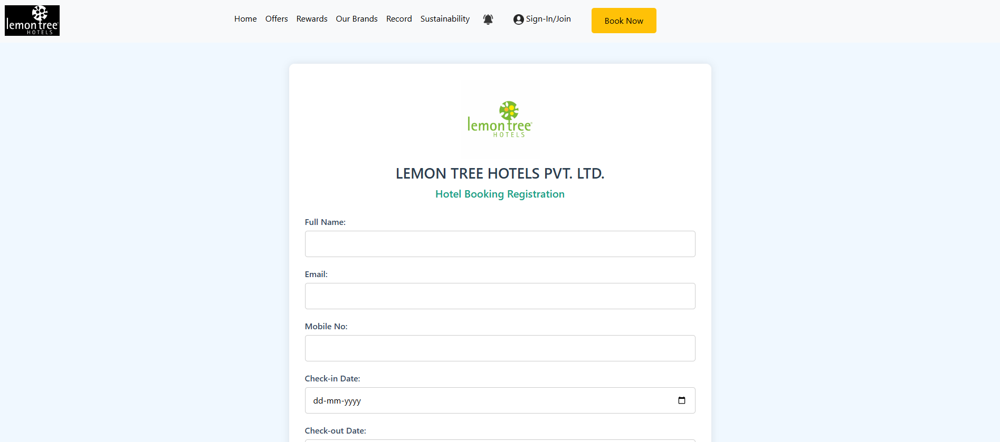

# 🏨 Hotel Management Web App

A modern hotel management web application built with Django. This project demonstrates a complete booking system with a beautiful user interface for managing hotel reservations and displaying facilities.

## 📸 Screenshots

| Home Page | Registration Form | Facilities Page |
|-----------|-------------------|------------------|
|  |  |  |

## ✨ Features

- **🏠 Landing Page** - Professional hotel branding with modern design
- **📝 Booking System** - Complete reservation form with validation
- **🏨 Facilities Display** - Showcase hotel amenities and services
- **📱 Responsive Design** - Mobile-friendly interface using modern CSS
- **🔒 Security** - Django CSRF protection and secure backend
- **⚡ Performance** - Optimized loading and smooth user experience

## 🛠️ Technology Stack

### Frontend
- **HTML5** - Semantic markup structure
- **CSS3** - Modern styling with responsive design
- **JavaScript** - Interactive elements and form validation

### Backend
- **Python 3.x** - Core programming language
- **Django** - Web framework for rapid development
- **SQLite** - Default database (easily configurable)

### Tools & Version Control
- **Git** - Version control system
- **GitHub** - Repository hosting

## 🚀 Quick Start Guide

### Prerequisites
- Python 3.7 or higher
- Git installed on your system

### Installation Steps

1. **Clone the Repository**
   ```bash
   git clone https://github.com/tejasssarnaik/Hotel-Management-Django-Project.git
   cd Hotel-Management-Django-Project
   ```

2. **Create Virtual Environment**
   ```bash
   # Create virtual environment
   python -m venv venv
   
   # Activate virtual environment
   # On Windows
   venv\Scripts\activate
   
   # On macOS/Linux
   source venv/bin/activate
   ```

3. **Install Dependencies**
   ```bash
   pip install -r requirements.txt
   ```

4. **Database Setup**
   ```bash
   python manage.py makemigrations
   python manage.py migrate
   ```

5. **Run Development Server**
   ```bash
   python manage.py runserver
   ```

6. **Access Application**
   - Open your browser and navigate to: `http://127.0.0.1:8000`

## 📁 Project Structure

```
Hotel-Management-Django-Project/
├── 📁 peoplemanagement/           # Main Django application
│   ├── 📁 templates/              # HTML template files
│   │   ├── home.html             # Landing page template
│   │   ├── booking.html          # Booking form template
│   │   └── facilities.html       # Facilities display template
│   ├── 📁 static/                # Static assets
│   │   ├── 📁 css/               # Stylesheet files
│   │   │   └── booking.css       # Main styling
│   │   └── 📁 images/            # Image assets
│   │       ├── hotelwebimage1.png
│   │       ├── hotelwebimage2.png
│   │       └── hotelwebimage3.png
│   ├── models.py                 # Database models
│   ├── views.py                  # Application views
│   ├── urls.py                   # URL routing
│   └── admin.py                  # Django admin configuration
├── 📁 management/                # Django project configuration
│   ├── settings.py               # Project settings
│   ├── urls.py                   # Main URL configuration
│   ├── wsgi.py                   # WSGI application
│   └── asgi.py                   # ASGI application
├── db.sqlite3                    # SQLite database
├── manage.py                     # Django management script
├── requirements.txt              # Python dependencies
└── README.md                     # Project documentation
```

## 🎯 Usage

### Booking a Room
1. Navigate to the home page
2. Click on "Book Now" or navigate to the booking form
3. Fill in your personal details and booking preferences
4. Submit the form to complete your reservation

### Viewing Facilities
1. Visit the facilities page from the navigation menu
2. Browse through available hotel amenities
3. Get detailed information about each facility

## 🔧 Configuration

### Database Configuration
The project uses SQLite by default. To use a different database:

1. Install the appropriate database driver
2. Update `DATABASES` in `management/settings.py`
3. Run migrations: `python manage.py migrate`

### Static Files
Static files are served from the `peoplemanagement/static/` directory. In production, configure your web server to serve these files efficiently.

## 🧪 Testing

Run the test suite to ensure everything is working correctly:

```bash
python manage.py test
```

## 📝 Contributing

1. Fork the repository
2. Create a feature branch: `git checkout -b feature-name`
3. Make your changes and commit: `git commit -m 'Add feature'`
4. Push to the branch: `git push origin feature-name`
5. Submit a pull request

## 📄 License

This project is open source and available under the [MIT License](LICENSE).

## 👤 Author

**Tejas Sarnaik**

- 🐙 GitHub: [@tejasssarnaik](https://github.com/tejas-sarnaik)
- 📧 Email: tejassarnaik2120@gmail.com
- 🔗 Project Link: [Hotel Management Django Project](https://github.com/tejas-sarnaik/Hotel-Management-Django-Project)

## 💼 Services

Looking for custom web development solutions? I'm available for freelance projects and consultations. Feel free to reach out for:

- Custom Django web applications
- Hotel management systems
- Responsive web design
- Database design and optimization

Contact me at: **tejassarnaik2120@gmail.com**

---

⭐ **If you found this project helpful, please consider giving it a star on GitHub!**
